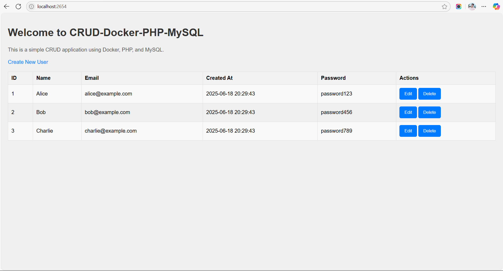
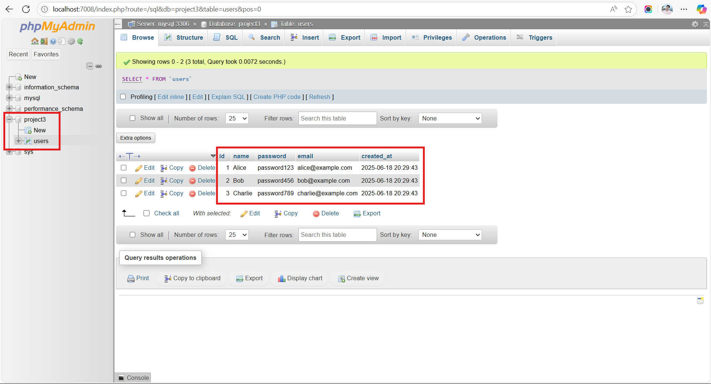

# 🚀 PHP CRUD App with Docker, MySQL, and phpMyAdmin

This project is a simple **PHP CRUD application** running inside Docker containers using **Docker Compose**. It includes:

- A PHP + Apache container
- A MySQL database container
- phpMyAdmin for easy database management

---

## 📦 Features

- 🔧 Containerized setup with Docker Compose
- 🐘 MySQL database with volume persistence
- 🌐 phpMyAdmin for visual DB access
- 🧰 Easy to run and deploy anywhere
- 📝 Sample database initialization script

---

## 📁 Project Structure

```text
php-crud-app/
├── docker-compose.yml
├── php/
│   ├── Dockerfile
│   └── index.php         # Your PHP CRUD logic goes here
├── db/
│   └── init.sql          # Optional initial DB script
|  screenshots/
|   ├── app-home.png
|   └── phpmyadmin.png
└── README.md

```

## 🛠️ Getting Started

### ✅ Prerequisites

Make sure you have the following installed:

- [Docker](https://www.docker.com/products/docker-desktop)
- [Docker Compose](https://docs.docker.com/compose/)


### 🚀 Run the App

In your project directory, run:

```bash
docker-compose up --build
```


### 🌐 Access the App

| Component    | URL                                            |
|--------------|------------------------------------------------|
| PHP App      | [http://localhost:2654](http://localhost:2654) |
| phpMyAdmin   | [http://localhost:7008](http://localhost:7008) |


**phpMyAdmin Login Credentials:**

- **Username:** `root`
- **Password:** `root`

### 🧪 Customize the App

Add PHP files to the php/ directory
Modify SQL in db/init.sql to pre-load data
Update docker-compose.yml as needed

---

## 💡 Tips & Best Practices
### Start/Stop application command
**up:**
```
 docker-compose up --build
```
**down:**
```
docker-compose down -v
```
**logs:**
```
docker-compose logs -f
```
**ssh to container (php) :**
```
docker exec -it php /bin/bash
```

### 🔎 View Logs for Debugging
Explain how to check logs:
```bash
# View logs for all services
docker-compose logs -f
```
```
# View logs for a specific service (e.g., PHP app <my-php-web>)
docker-compose logs -f my-php-web
```
```
# Access container shell
docker exec -it <container_name> /bin/bash
```

### 🧹 Cleanup Commands
Add useful Docker cleanup commands:
```bash
# Stop all containers
docker-compose down
```
```
# Remove all containers, volumes, and networks
docker-compose down -v
```
```
# Prune unused Docker resources (be careful!)
docker system prune -a
```


---
## 🛠️ Troubleshooting

Here are some common issues and how to fix them:

### ❌ `mysqli_connect(): not found` or `Call to undefined function mysqli_connect()`

**Cause:** The PHP container is missing the `mysqli` extension.

**Fix:**  
Update your `php/Dockerfile` to install the required extension:

```Dockerfile
FROM php:8.1-apache

# Install mysqli extension
RUN docker-php-ext-install mysqli

# Copy app files
COPY . /var/www/html/
```
You can also try to run the command inside the my-php-web containser
```
#command to go inside the container
docker exec -it my-php-web /bin/bash
```
```
#restart the container
docker restart my-php-web
```
### ❌ `phpMyAdmin cannot log in to MySQL`

**Cause:** Incorrect login credentials or MySQL container not ready yet.

**Fix:** Ensure the credentials match your docker-compose.yml. Example:
```yaml
environment:
  MYSQL_ROOT_PASSWORD: root
```
Wait a few seconds for MySQL to fully initialize before accessing phpMyAdmin.
Restart containers if needed:
```bash
docker-compose down
docker-compose up --build
```

### ❌ `Connection refused" or App can't connect to MySQL`
**Cause:** PHP app can't reach the MySQL container.

**Fix:** In your PHP code (e.g., index.php), use the service name as the host:
```php
$conn = new mysqli("db", "root", "root", "your_database");
```
Ensure the database name matches what’s set in ```docker-compose.yml```.

### ❌ `MySQL Data Not Persisting`
**Cause:** Volume configuration might be incorrect or missing.

**Fix:** Make sure you define a persistent volume for MySQL in docker-compose.yml:

```yaml
volumes:
  - mysql_data:/var/lib/mysql
```
And define the volume at the end of the file:
```yaml
volumes:
  mysql_data:
```

### 📝 License
This project is open-source and free to use for learning and development.

### 🙋‍♂️ Author
Chandan
🚀 IT Engineer | Docker & PHP Enthusiast
📧 chandansahu7980@gmail.com

## 🖼️ Screenshots

### PHP App UI



### phpMyAdmin



